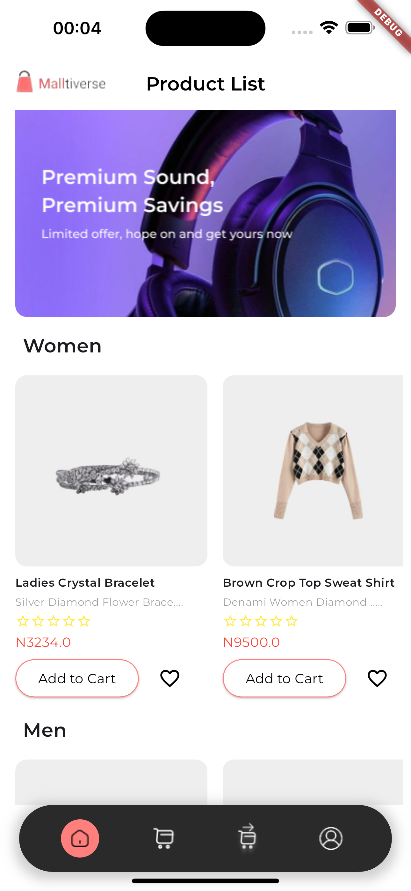
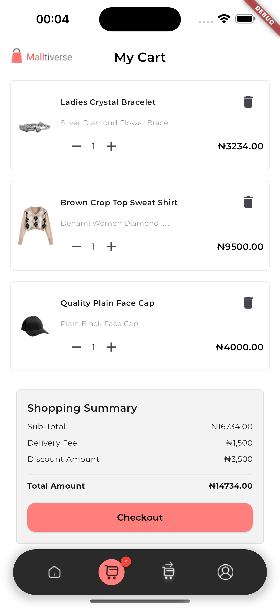
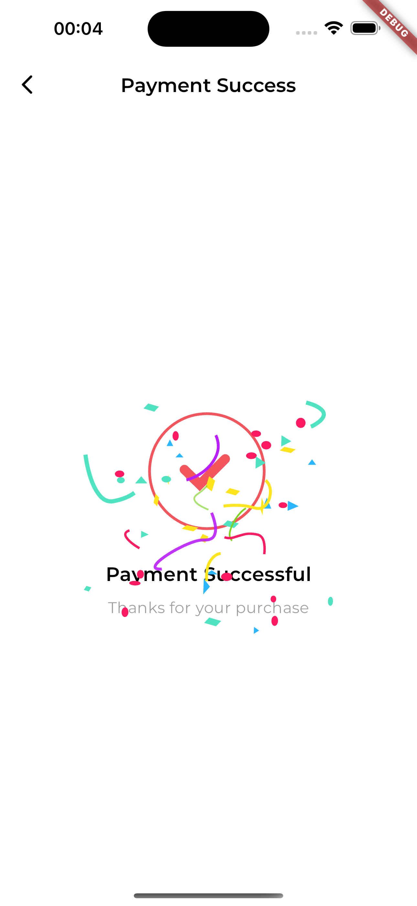

# Malltiverse E-Commerce App

Malltiverse is a Flutter-based e-commerce application that allows users to browse products, add items to their cart, and proceed to checkout. This app is designed with a clean and modern user interface, providing a seamless shopping experience.

## Features

- Browse various product categories including Tech Gadgets, Men's Fashion, and Women's Fashion.
- Add products to the cart.
- View cart items with total amount calculation.
- Navigate through different pages such as Home, Cart, Checkout, Payment, and Payment Success.

## Screenshots

**Home Page**



**Cart Page**



**Order Success Page**



## Installation

To get started with the Shopping App, follow these steps:

1. **Clone the repository**:
   ```bash
   git clone https://github.com/Kellytomi/malltiverse.git
   cd malltiverse

2. **Install Dependencies**:
   ```bash
   flutter pub get

3. **Run the app**:
   ```bash
   Flutter run

## Usage

**Home Page**

- Browse the list of available products.
- Use the search bar to filter products.

**Cart Page**

- View products added to your cart.
- Increase or decrease product quantity.
- Swipe left to remove a product from the cart. 

**Checkout Page**

- View the cart summary and subtotal.
- Proceed to checkout.
